# Front-end

In this document we will go through all the components and files residing in the frontend folder.  
Frontend folder has following files & folders on the root directory

1. package.json
2. package-lock.json
3. webpack.config.js
4. node_modules
5. public
6. src

## Let's go through them one by one 

1. **package.json**: The package.json file is the heart of Node.js system. It is the manifest file of any Node.js project and contains the metadata of the project.  
Currently our project have two custom scripts `webpack` and `build`.`webpack` script starts the webpack in `watch mode` using configuration from `webpack.config.js` whereas `build` will simply run the `webpack` once.  
Wanna know what webpack is? [Click Me](https://webpack.js.org/)

2. **package-lock.json**: It has the record of each installed package which allows you to re-install them. Only delete this file in case of emergency.

3. **webpack.config.js**: It hold the configuration that is to be used by `webpack`.  
Wanna know what webpack is? [Click Me](https://webpack.js.org/)  
Currently the configuration is set to do following three operation.
    - Clean the public folder in the backend directory
    - Copy all files residing in public folder of frontend to public folder of backend
    - build the react project and move it a build directory inside public folder of backend  

4. **node_modules**: node_modules is where npm modules are saved. If you open node_modules , you should see a folder named react , which contains the code that makes React run.

5. **public**: You will found `assets` folder and `index.html` file in this directory.  
    - **assets**: Responsible for containing all assets imported in `index.html` file
    - **index.html**: As we know react is actually a Single-Page Application and this is the file which is loaded and as a user interact other components are loaded without refreshing a page

6. **src**: This is the folder where the whole source code of our project resides whether it is component, service or a worker.  
It has a folder `component` and two files `index.js` and `index.css` at root level.
    - **action**: This folder contains all the methods used in project frequently.
        - **common.js**: This file contains all the common methods which are being used through the project.  
    Currently it has 4 methods
            - **isUserLoggedIn**: return user `token` value if user user is logged in or else return `undefined`
            - **successErrorHandler**: you can pass an error object to this method to show a error toast.
            - **showToastrError**:  you can pass an message along with type to this method to show a toast message.
            - **getHeaders**: It takes `token` value as input and return with a header object
        - **validation.js**: This file contains all the api call methods used for user validation/auth.
    - **audio**: It has all the configuration for the audio components.
    - **component**: It has all the configuration and source code of various components.We will talk about it in detail below.
    - **reducers**: Folder containd the reducers used in redux.
    - **api.js**: This file contains all the functions that you will ever need to make api calls. Every method in it is self-explanatory, we are sending a token which we got from redux store along with every api call for validation.
    - **App.css**: Conatins css rules which are being imported in `App.js`.
    - **App.js**: The `App.js` file is usually the initial file to a React app.
    - **constants.js**: You can add all constants that you want to use throughout the project in this file.
    - **index.css**: Conatins css rules which are being imported in `index.js`.
    - **index.js**: A src level `index.js` is the initial place in a React-based application where you tell React to physically mount the App Component to the actual HTML DOM, on a container element, something like this and say that 'root' is an ID of an element already on the page before your JavaScript loads.
    - **registerServiceWorker.js**: The service worker is a web API that helps you cache your assets and other files so that when the user is offline or on slow network, he/she can still see results on the screen, as such, it helps you build a better user experience
    - **router.js**: In single page apps, there is only single html page.we are reusing the same html page to render the different components based on the navigation and this file use `react-router-dom` to handle navigation in our current app.
    - **store.js**: Responsible for initializing redux store  in our project.
    - **storeX.js**: A constant currently being used to store auth token and required function.It's functionalities will soon be merged in the redux store.

### src/components

Every component folder follow the same pattern and splitted in various files with reusability in mind.Mostly you will encounter with two files `index.js` and `actions.jsx`.`index.jsx` is a entry point to that specific component and `actions.jsx` have the api calls method which are being used in that particular component.  

Now, as we are done with the basic information we will go through the components one by one.

1. **about**: It's a simple static page.

    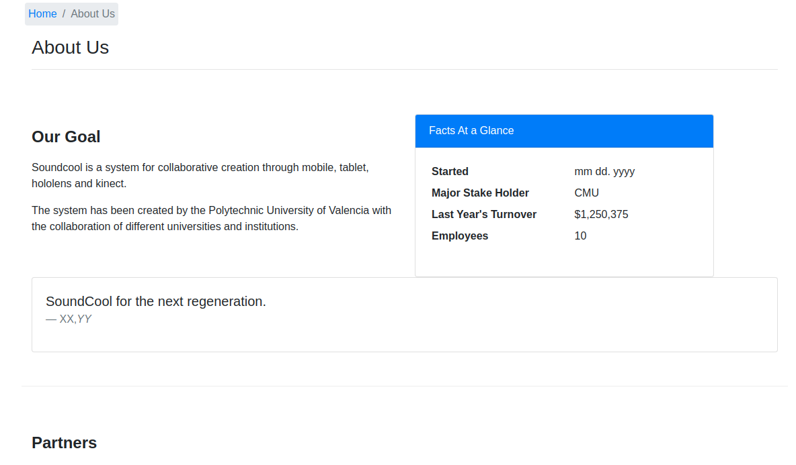

2. **addSound (Class: AddSound)**:This one return the component shown below.  
    - **required props**: 
        - `name`: onSoundSelect, `type`: method  

    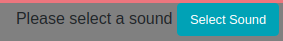

    If you click on the `select sound` button below modal will appear listing all the sounds files current user have.

    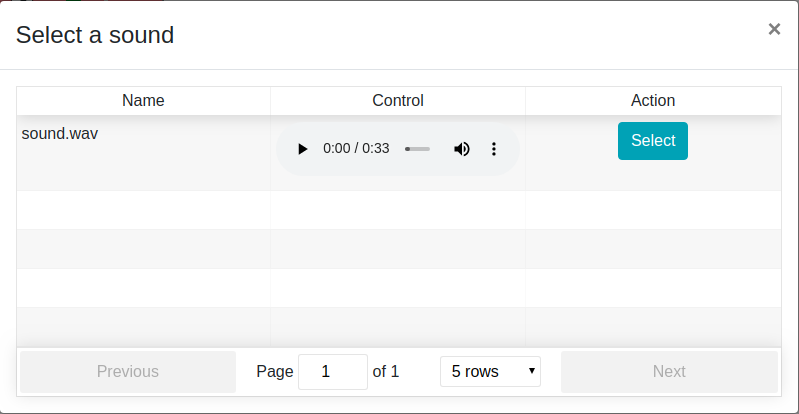

    How it does that?

    When you click the `select sound` it calls the `fetchAudio` method to get information from the database and store them in the component state.Once the information is saved it calls the toggleModal button which simply results in the above shown modal.The bootstrap modal have a `ReactTable` component inside it's body and use the data from the component state to display the rows.  

    You can see the `select` button along with every row in the table, it pass the info of the selected sound to the method `onSoundSelect` which is passed as a prop to the component.

    Note: we will talk about the `fetchAudio` method and `player` which is shown in the control column in `sounds` component

3. **audioUI**: This folder consist of various audio component GUI which can be directly imported and used throught the project.

4. **contact (Class: Contact)**: It's a simple static page.  

    

5. **form**: This folder consist of various self-explanatory custom made advance form input component which can be directly used throught the project

6. **header (Class: Header)**: Only has a one simple `index.js` file which is resposible for rendering a dynamic navbar. It uses the method `isUserLoggedIn` from `common.js`. 

    If no user is logged then the returned navbar will look like

    

    If a user is logged in then the returned navbar will look like

    

    The `logout button` which appear when a user is logged in, clears the `session storage` and `redirect user` to the root when `clicked`.

7. **home**:  It's a simple static page.

    

8. **login**: It has three files.
    - **actions.js**: This one has the following api call methods
        - **loginUser**: It takes the email and password as payload and return the token on successfull login or else return with a error message.More info : [/api/v1/user/sign_in](../API/login)

        - **redirectToHome**: Method to redirect window to home
    - **form.jsx (Class: LoginForm)**: 
        - **props**:
            - `name`: afterSignin, `type`: method

        It returns a form component with two input fields `email` and `password` with a submit button.Values in the component state for `email`and `password` is initializaed as null and changes with input change in form fields. 

        When submit button is clicked the state values of `email` and `password` is passed as payload to `loginUser` method and once a user is logged in `afterSignin` method is triggered which was passed as prop.
    - **index.jsx (Class: Login)** It render the `LoginForm` class alog with a router link to move to register page.A screenshot is shown below. 
    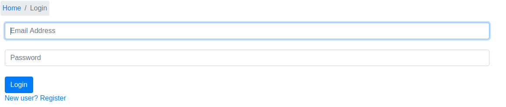

9. **projectEditor(Class: ProjectEditor)**:  I will only be covering top level of this component.

    - **actions.js**: This one has the following api call methods
        - **updateProject**: It can be used to update project information if you have a project_id. More Info:  [/api/v1/projects/update](../API/projects/update)

        - **createProject**: You can pass the project details to this method and it will insert the project in the database. More Info:  [/api/v1/projects/new](../API/projects/new)

        - **fetchUserProject**: It takes projec_id as input and extract all info of it from the server and save it in the component state.

    - **index.css**: Stylesheet rules imported in `index.js` of current level

    - **index.js**: This component allow you to `create`, `edit` and `export` a project.

    It return a different view based on the user is logged in or not as we show in `header`.  
    Below is a the view which is returned if a user is not logged in, we can only create a project in this case.  

    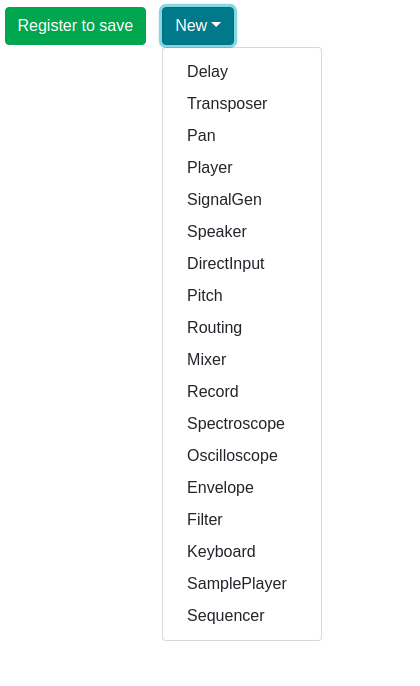

    We only have two actions in this case.
        - **New**:  It's a dropdown button using which you can add different sound modules in the project. More Info [Module Walkthrough](../GUI/module_walkthrough)
        - **Register to save**: This component has two modal in it.One is to register a user and other is where user can put project name and description.

        This button will open the modal for registeration as shown below.

        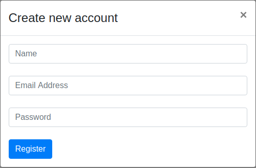

        This modal simply render the `RegisterForm` Class in the modal body.  
        Once, you have registered the second modal will appear as shown below asking for the project information so it can be saved in the database.

        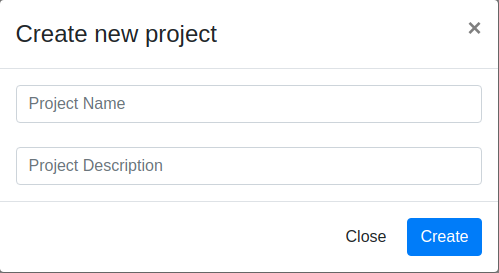

        Once you filled the information and click on the `Create` button the info will be passed to the `createProject` method which make a entry for that project in the database and once it's done user gets redirected to the project edit screen.

    Now we will talk about how this component is rendered if a user is logged in.  
    In create mode, process will remain the same but this time `user register` modal will be skipped.  

    In this section, we will check how the existed project is `saved` and `exported`.You can check component view in the image below.

    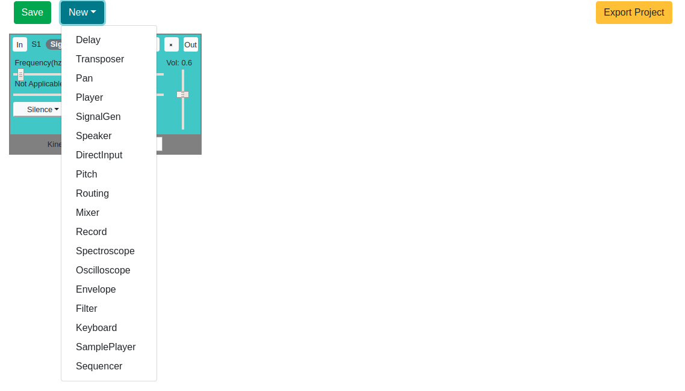

    We have a 3 functionalities

    - **New**: It's same as we explained earlier

    - **Save**: When it's clicked it get the state from redux store and pass it to the `updateProject` method.

    - **Export Project**: This button first extract the state from redux store then calls a local `downloadFile` method which is responsible for writing the project information in a json file and triggering the download. 

10. **projects**:
    - **actions.jsx**: This one has the following api call methods

        - **removeProject**: It takes the project_id as payload and delete it to the server.More info : [/api/v1/projects/remove](../API/projects/remove)

        - **cloneProject**: It takes the project_id as payload and make a copy of it and save it to the server with owner as current user. More info : [/api/v1/projects/addShare](../API/projects/sharing/add)

        - **addSharedUser**: It takes the updated sharing setting in payload and sync it with the server. More info : [/api/v1/projects/removeShare](../API/projects/sharing/remove)

        - **removeSharedUser**: It takes the user_id or email and project_id in payload and remove that user to the project as shared_user.More info : [/api/v1/projects/get](../API/projects/get)

        - **setProjectPublic**: It takes the project_id as payload and update it's public flag to true in the databse. More info : [/api/v1/projects/setPublic](../API/projects/sharing/public)

        - **fetchUserProjects**: It fetch info of all the project owned or shared by/with current user from the databse. More info : [/api/v1/projects/get](../API/projects/get)

    - **index.jsx**: This file return the component shown below.It mainly consist of two parts, first is a table which list all theproject owned or shared by/with current user and second is the action row above table having a `Search Input`and `Import Project` button.

        
    First, let's talk about how the table is being rendered.  
    When component gets mounted it calls the method `fetchUserProjects` which returns the projects list from database which is used as the rows in the shown table as well as stored as `projects` property in component state.  
    Let's talk about each column of the shown table.
        - **Name** : Name of the project
        - **Description** : Description of the project if it has any
        - **Created By** : It shows the user_id of the owner of the project
        - **Shared With** : It shows the project sharing status, it will show **Everyone** if the project is public or else simply list the user_id of users who can access this project.
        - **Actions**: It has as a total of 4 buttons `Edit`, `Share`, `Clone` and `Delete`.`Clone` and `Delete` button are conditional as you can only delete a project is you own it and you can only clone a project if it's shared with you.
            - **Edit**:  It will simply redirect you to the `projectEditor` component where you can edit the project.
            - **Share**: We do have two modal in this component.Once is to add a new shared user and other is to remove a user or set the project to public.  
            Once, you click on the share button below modal will appear.As you can see we have a `toggle button`, a list of `users` along with a `delete` button and a `Add` button on right hand side of `User List` heading.  
                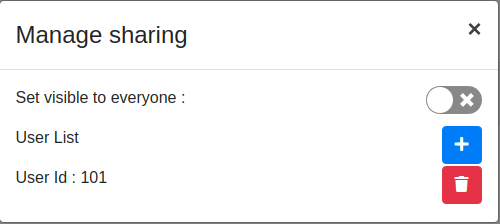  
                - **Toggle Button**: It trigger the method `setProjectPublic` with current toggle button value as payload which return updated project sharing setting.
                - **Delete Button**: It remove that user from project sharing setting and pass the updated setting to `removeSharedUser` method which result in updation of change on database.
                - **Add Button**: It provides a way to share the project with another user.Below modal will appear once you clicked on it.  
                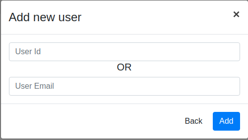  
                Here you can see two input fields, you need to enter wither `user_id` or `email` to add an user.You can't enter both as the other input will automatically disappear once you start typing in one of them.
                    You can click on the `add` button to trigger `addSharedUser` method.
            - **Clone**: It trigger a `cloneProject` method and add the retuned project info ny method to component state.
            - **Delete**: It trigger a `confirm dialog` for deletion and once the `user confirm it` calls `removeProject` method passing `project_id` as payload which results in deletion of the project from the server.
        Now, let's go through the top actionbar
        - **Search Input**: The table on the page do a filteration based on a `filter` string and only show the projects which pass that filter.This input is responsible for updating the value of `filter` string on every input change.  
        - **Import Project**: Onclicked it trigger a click on `input` of `file type` resulting in a window of file selection where you can select a valid project JSON.Once you select a valid project JSON, it's passed to the `handleFileRead` method which reads the JSON and extract all needed project values and save it to server.

11. **register**:

    - **actions.js**: This one has the following api call methods
        - **registerUser**: It takes the email, password and name as payload and return the token on successfull registeration or else return with a error message.More info : [/api/v1/user/register](../API/register)

        - **redirectToRoot**: Method to redirect window to root
    - **form.jsx (Class: RegisterForm)**: 
        - **props**:
            - `name`: afterRegister, `type`: method

        It returns a form component with three input fields `name`, `email` and `password` along with a submit button.Values in the component state for `name`, `email`and `password` is initializaed as null and changes with input change in form fields. 

        When submit button is clicked the state values of `name`, `email` and `password` is passed as payload to `registerUser` method and once a user is registered `afterRegister` method is triggered which was passed as prop.
    - **index.jsx (Class: Register)**: It render the `RegisterForm` class alog with a router link to move to login page.A screenshot is shown below.

        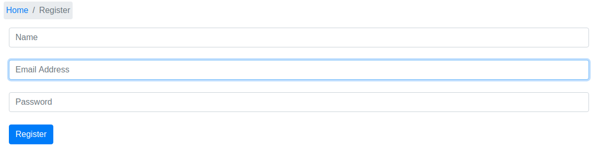

12. **sounds (Class: Sounds)**: It has two files.
    - **actions.jsx**: This one has the following api call methods

        - **serveAudio**: This method is for the media which are uploaded by the user, it takes the sound_id as payload and return a url which respond with the media file on triggered. More Info: [/api/v1/sounds/serveAudio/:audioId/:token](../API/media/stream)

        - **getAudio**: This method is for the media which are added using an external link, it takes the sound_id as payload and return a the external url submitted by user.More Info: [/api/v1/sounds/getAudio/:audioId/:token](../API/media/getAudio)

        - **uploadSound**: It takes the audio file as payload and upload it to the server.More info : [/api/v1/sounds/upload](../API/media/upload)

        - **removeAudio**: It takes the audio_id as payload and remove it to the server .More info : [/api/v1/sounds/remove](../API/media/remove)

        - **fetchAudio**: It fetch info of all the media uploaded by current user from the databse .More info : [/api/v1/sounds/get](../API/media/get)

        - **toggleAudioSharing**: It's used to change the media sharing mode of current user. More info : [/api/v1/sounds/toggleAudioSharing](../API/media/toggleMediaSharing)

        - **addSoundLink**: This method add the link to the database and return with the added media information from database. More info : [/api/v1/sounds/addSoundLink](../API/media/addSoundLink)

    - **index.jsx**: This file return the component shown below.It mainly consist of two parts, first is a table which list all the sounds uploaded or added by current user and second is the action row above table having three button `Make Media Public : Yes/No`, `Upload Sound` and `Add Online Sound`

        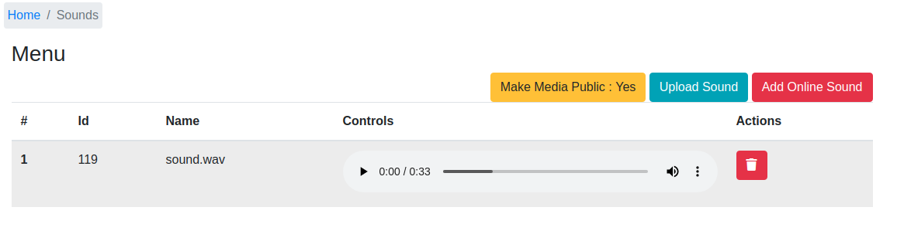

    First, let's talk about how the table is being rendered.  
    When component gets mounted it calls the method `fetchAudio` which returns the sounds list from database which is used as the rows in the shown table.  
    Let's talk about each column of the shown table.

    - **Id** : It's the sound_id which is unique to every media 

    - **Name** : Name of the uploaded sound

    - **Controls**: It actually render a `ReactAudioPlayer`, which takes `src` prop as to identify which sound to play.we get the `src` value by passing `sound_id` to the `serveAudio` method if it's uploaded on the server or if it's a sound link we use `getAudio` method.

    - **Actions**: It has a `delete button` which simply trigger a `confirm dialog` for deleting and once the `user confirm it` calls `removeAudio` method passing `sound_id` as payload which results in removal of the media from the server.

    Now, let's go through the button in top actionbar one by one

    - **Make Media Public : Yes/No**: It simply calls `toggleAudioSharing` method with the desired state result in changing sharing setting of the user.

    - **Upload Sound**: Onclicked it trigger a click on input of file type resulting in a window of file selection.If you select a file, it's passed to the **uploadSound** method which results in uploading of the selected file.Sound info is returned once the sound is successfully uploaded.

    - **Add Online Sound**:  Onclicked it trigger a input dialog asking for the url of the media you want to add as shown below.If you enter a valid url, it's passed to the `addSoundLink` method which results in addition of the selected url in the database.Sound info is returned once the sound is successfully added.  

      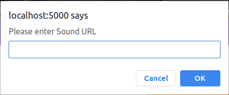
