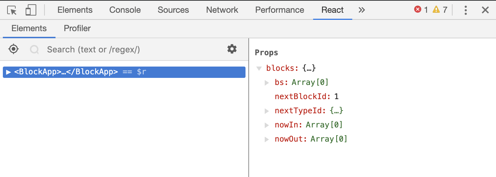
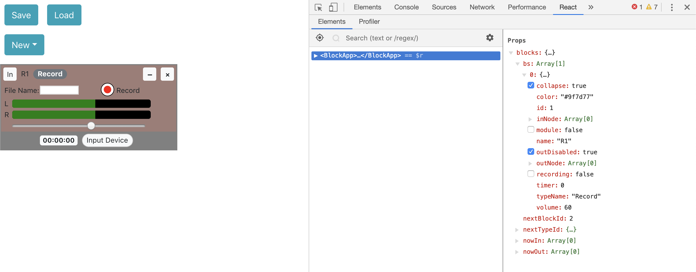

# Soundcool GUI Objects

This is the folder that contains the GUI Objects such as Delay, Transposer, Speaker, etc. It uses React and Redux, and next three sections are explanations of the architecture.

## Redux in one minute

- Redux is like a central processor of the information. It has a single store, that keeps the state of literally all the information you need for the app, like the information of the sound modules, page layouts, etc. The advantage is that you there is only a single source of truth, that everything else just renders from the information provided by the store but not having local controls. Of course, the updates of information are also done in the store (so we don’t need a thousand of “event handlers” function). Reducers are the method that help us updating the store: it takes in (old state, action) and output new state.

- To be specific, there are only three functions that we actually use and relate to the store:

  - Store.getState
    - Get the current state and you can use all the information in it.
  - Store.dispatch
    - The most frequently used function: it dispatches an action that goes into Reducer, and Reducer will output new state from old state and action. Each time you drag the slider, or input some text, or add a new block, you are calling dispatch function to change the state.
  - Store.subscribe
    - Render function that refreshed with the update. Usually it’s only going to be used only once in the code (index.js), so don’t worry too much.

- combineReducers
  - Reducers can be combined to produce a higher level store! I am writing the GUI of all the sound modules (which I call “blocks” here) so I have a store that keeps the information of blocks, while other developers are writing the webpages that have store that keeps information of pages. To unite all these into an app and keeps track of all states, simply call combineReducers can give a store that has information on both sides.

## My Redux State (important!)

- reducer blocks (in /reducer/blocks.js) contains a state of all the informations of blocks.
  - {bs, nextBlockId, nextStateId, nowIn, nowOut} are the five elements in this state.
  - bs: a list of all the blocks. Each block is represented as an object. Fields like id are common to all types of block, but other informations are specific to the type of block, like frequency of signalGen, speed of player. A complete documentation of these can be found in /Components/blockSpecs.jsx, which documents default values of all types of blocks.
    - Example of a Delay block:
    - {id: 5, name: “D1”, typeName: “Delay”, audioObj: #an audio object from backend#, delayTime: 76, feedback: 0.119, kinect: false, osc: 8013}
  - nextBlockId: the id of next block. Incremented each time when a new block is created. e.g. if we currently have 2 blocks, then the current nextBlockId should be 3.
  - nextStateId: an object that documents the next id of different types. e.g {delay: 1, transposer: 4, speaker: 2 ….}. This number is used to give the name of each block, like “D2”, “P3”.
  - nowIn: an array of four, documents the port that the user is trying to connect in.
    - [name, port number, blockid, audioObj]
    - name is a string like “S1”, will be rendered on the corner when connection is established.
    - port number is the index of In port on the block. Some blocks, like mixer, router, have more than one place to connect in, so the port number identifies which in port that on the block that we are trying to connect. Not to be confused with the index of the block.
    - blockid: the unique id of the block.
    - audioObj: the backend audio Object that we are trying to connect.
  - nowOut:
    - Same as nowIn, also an array of four with the same information.

<!-- ``` -->




<!-- ``` -->

## What each file does

- Files to ignore (probably will be useful so I keep them):

  - App.js
  - App.css
  - App.test.js

- Audio folder:

  - Webaudio objects from backend, called when addblock action is triggered. (Imported and used in /reducers/block.js)

- Reducers folder:

  - blocks.js
    - As explained in section 1, Reducers are the method that does (old state, action) => new state. This method case on different type of actions like “ADD_BLOCK”, “CHANGE_BLOCK”, “CONNECTING_BLOCK”, etc. Since block list “bs” is a list, usually it pass the action down to the reducer for individual block “block.js” by a mapping.
  - block.js
    - Similar to blocks.js but it only works on the information of individual block instead of a block list. Think about it as just a helper of blocks.js.

- Components folder
  - types folder
    - A folder contains all types of components. Note that each component is just a function since Redux already takes care of the information processing. Component doesn’t contain any local information or do any processing, it just renders the information that being passed to it. /All.jsx import and export them all.
  - WithHeader.jsx
    - A high order functional component. Since the header (the bar at the top that has the collapse or delete button) is almost generic to all the blocks, there is no need to repeat in each component definition. WithHeader takes in a component of a specific type and add header on it.
  - blockSpecs.jsx
    - The default values of all the block type-specific fields (like the delayTime of Delay, speed of Player). Imported and used in /AddBlock.jsx, when an ADD_BLOCK action is triggered, these values are bing sent along with the action.
  - AddBlock.jsx
  - SLButton.jsx

<!-- ## Running the tests

Explain how to run the automated tests for this system

### Break down into end to end tests

Explain what these tests test and why

```
Give an example
```

### And coding style tests

Explain what these tests test and why

```
Give an example
```

## Deployment

Add additional notes about how to deploy this on a live system

## Built With

* [Dropwizard](http://www.dropwizard.io/1.0.2/docs/) - The web framework used
* [Maven](https://maven.apache.org/) - Dependency Management
* [ROME](https://rometools.github.io/rome/) - Used to generate RSS Feeds

## Contributing

Please read [CONTRIBUTING.md](https://gist.github.com/PurpleBooth/b24679402957c63ec426) for details on our code of conduct, and the process for submitting pull requests to us.

## Versioning

We use [SemVer](http://semver.org/) for versioning. For the versions available, see the [tags on this repository](https://github.com/your/project/tags).

## Authors

* **Billie Thompson** - *Initial work* - [PurpleBooth](https://github.com/PurpleBooth)

See also the list of [contributors](https://github.com/your/project/contributors) who participated in this project.

## License

This project is licensed under the MIT License - see the [LICENSE.md](LICENSE.md) file for details

## Acknowledgments

* Hat tip to anyone whose code was used
* Inspiration
* etc -->
